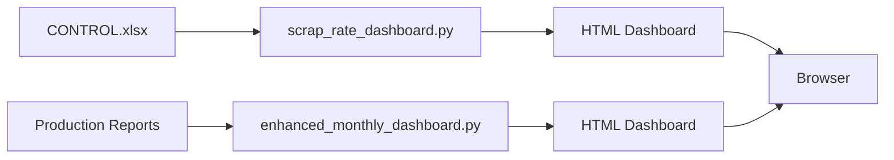

# SCRAP-rate Analytics Dashboard

Professional Business Intelligence dashboards for manufacturing quality control and scrap rate analysis.

## 📁 Project Files

### 1. **CONTROL.xlsx**
Excel file containing quality control data with sheets:
- **Piese - Proces extern** - External process parts
- **Piese finite pentru livrare** - Finished parts for delivery
- **Rebuturi trimise catre client** - Scrap sent to client
- **P.Quarantine** - Quarantine parts
- **Drop Down List** - Reference data

### 2. **scrap_rate_dashboard.py** ⭐ NEW
Generates comprehensive scrap rate analysis dashboards from CONTROL.xlsx.

**Features:**
- Reads and parses CONTROL.xlsx using openpyxl
- Calculates scrap rates, quality metrics, and trends
- 5 interactive Chart.js visualizations:
  - Scrap rate trend over time (line chart)
  - Scrap rate by machine (bar chart)
  - OK vs NOK parts distribution (doughnut chart)
  - Scrap by category/sheet (pie chart)
  - Scrap rate by inspector (horizontal bar chart)
- Detailed statistics tables (machines and part numbers)
- Professional red-themed design
- Color-coded scrap rates (high/medium/low)

### 3. **enhanced_monthly_dashboard (item names).py**
Generates monthly production dashboards from HTML production reports.

**Features:**
- Scans production report HTML files
- Extracts OEE, quality rates, downtime, operator/machine performance
- Item-level production tracking
- Date-filtered analysis
- Interactive charts and trends
- SharePoint integration

## 🚀 Quick Start

### Prerequisites
```bash
pip install openpyxl
```

### Running the Scrap Rate Dashboard

1. **Run the script:**
   ```bash
   python scrap_rate_dashboard.py
   ```

2. **Select CONTROL.xlsx** when prompted

3. **Dashboard opens automatically** in your browser

4. **Output location:** Desktop with timestamp
   - File name: `SCRAP_RATE_Dashboard_YYYY-MM-DD_HH-MM-SS.html`

### Running the Monthly Production Dashboard

1. **Run the script:**
   ```bash
   python "enhanced_monthly_dashboard (item names).py"
   ```

2. **Select production reports folder** when prompted

3. **Dashboard opens automatically** in your browser

4. **Output location:** Desktop with timestamp
   - File name: `OLSTRAL_BI_Dashboard_YYYY-MM-DD_HH-MM-SS.html`

## 📊 Dashboard Screenshots

### Scrap Rate Dashboard
**Key Metrics:**
- Overall Scrap Rate (%)
- Quality Rate (%)
- Total Volume Checked

**Analysis Sections:**
- Scrap rate trends over time
- Machine performance comparison
- Inspector performance analysis
- Part number quality breakdown
- Category/sheet distribution

### Monthly Production Dashboard
**Key Metrics:**
- Overall Equipment Effectiveness (OEE)
- Monthly Quality Rate
- Total Parts Produced

**Analysis Sections:**
- OEE trends by day
- OK vs NOK parts distribution
- Machine and operator rankings
- Downtime analysis by category
- Item-level production filtering

## 🎨 Design Features

Both dashboards share:
- **Professional red theme** with gradient headers
- **Responsive grid layouts**
- **Interactive Chart.js visualizations**
- **Hover tooltips** with detailed data
- **Clean typography** (Segoe UI font family)
- **Modern card-based UI**
- **Color-coded status indicators**

## 📈 Metrics Explained

### Scrap Rate
```
Scrap Rate = (Suspects/NOK Parts / Total Checked) × 100%
```

### Quality Rate
```
Quality Rate = (OK Parts / Total Parts) × 100%
```

### OEE (Overall Equipment Effectiveness)
```
OEE = Availability × Performance × Quality
```

## 🔧 Technical Details

### Scrap Rate Dashboard (`scrap_rate_dashboard.py`)
- **Language:** Python 3.6+
- **Dependencies:** openpyxl, tkinter (standard library)
- **Input:** CONTROL.xlsx Excel file
- **Output:** Interactive HTML dashboard
- **Charts:** Chart.js 3.9.1
- **Icons:** Font Awesome 6.0.0

### Monthly Production Dashboard
- **Language:** Python 3.6+
- **Dependencies:** tkinter (standard library)
- **Input:** HTML production report files
- **Output:** Interactive HTML dashboard
- **Charts:** Chart.js 3.9.1
- **Icons:** Font Awesome 6.0.0

## 📂 Data Structure

### CONTROL.xlsx Columns
- **Data/Date** - Inspection date
- **Controlor** - Inspector name
- **Machine** - Machine identifier
- **Cantitate verificata dimensional** - Quantity checked (dimensional)
- **Cantitate verificata vizual** - Quantity checked (visual %)
- **SUSPECTE** - Suspect/NOK parts count
- **OBS** - Observations
- **Part Numbers** - Various formats (R900305231, F-688038.02-0411.WH.WE36, etc.)

## 🎯 Use Cases

### Quality Control Team
- Monitor scrap rates across machines
- Identify problematic part numbers
- Track inspector performance
- Analyze trends over time

### Production Management
- Overall equipment effectiveness tracking
- Machine and operator performance
- Downtime analysis
- Production volume trends

### Continuous Improvement
- Identify high-scrap machines/parts
- Compare quality rates period-over-period
- Track improvement initiatives
- Generate reports for management

## 🔄 Workflow



## 📝 Notes

- Both dashboards are **standalone HTML files** - no server required
- All data processing happens in Python
- Charts are rendered client-side with JavaScript
- No external database needed
- Export/print friendly

## 🆘 Troubleshooting

### "No module named 'openpyxl'"
```bash
pip install openpyxl
```

### "No module named 'tkinter'"
- On Ubuntu/Debian: `sudo apt-get install python3-tk`
- On macOS: Usually pre-installed
- On Windows: Usually pre-installed with Python

### Dashboard doesn't open automatically
- Check the Desktop folder for the generated HTML file
- Open manually in any modern browser (Chrome, Firefox, Edge, Safari)

### No data showing in dashboard
- Verify CONTROL.xlsx has data in the expected sheets
- Check that column names match expected patterns
- Review console output for parsing errors

## 📜 License

Internal use for OLSTRAL manufacturing quality control and production analytics.

## 👨‍💻 Author

Generated for SCRAP-rate project - Manufacturing Quality Analytics

---

**Last Updated:** December 11, 2025
